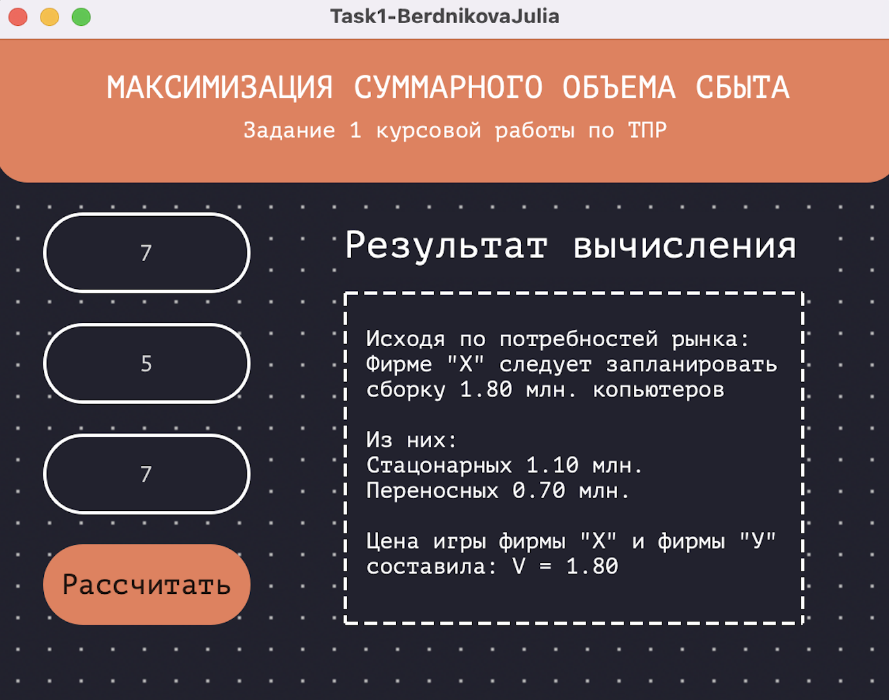
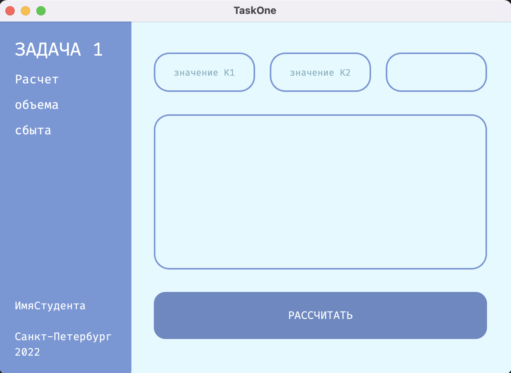
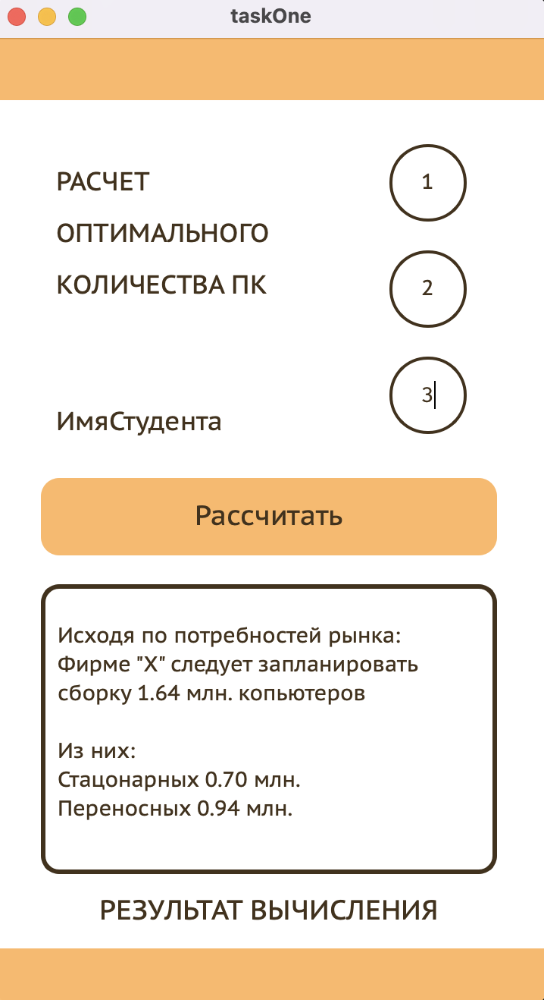

# Optimization-problem-design

Решение задачи теории принятия решений по оптимизации производства и создание графического интерфейса в нескольких вариациях. 
Автоматизирована первая задача из трех: "Обеспечение максимального суммарного объема сбыта ПК всех типов, собираемых фирмой" - задача на теорию игр. По введенному шифру изменяются вероятности покупки ПК конечным потребителем. 

## Установка

1. Установить PySide6 или более раннюю версию
>pip3 install pyside6
2. Создать графику в Designer 
3. Перейти в папку с проектом и изменить расширение файла c .ui на .py
>pyside6-uic gui.ui -o gui.py
4. Запустить main.py и проверить работоспособность 

## Пример графического интерфейса

Первая работа:

  

Вторая работа:

  

Третья работа:

  

## Примечание
Часть курсовой работы
